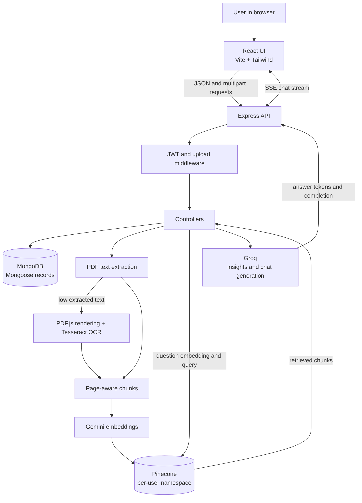
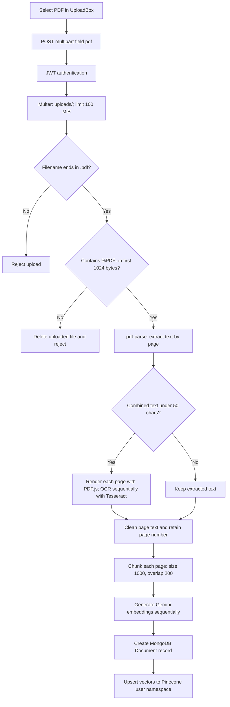

# PrepGenius-AI

> A document-grounded interview preparation assistant that turns study PDFs into searchable, page-cited conversations.


## Overview

PrepGenius-AI helps learners prepare for interviews using their own study material. A user uploads a PDF, asks questions in a conversation, and receives an answer generated from retrieved passages in their documents. The application keeps page information with document chunks so it can return source references and page citations alongside answers.

The current implementation uses React, Vite, and Tailwind CSS in the browser; Node.js and Express on the server; MongoDB for application records; Pinecone for vector search; Gemini embeddings for text vectors; and Groq for chat answers and document insights.

## Problem Statement

Interview preparation material is often spread across long PDFs. Searching those documents manually takes time, and a general-purpose chatbot may answer from knowledge that is not in the learner’s notes. PrepGenius-AI extracts and indexes PDF content, retrieves relevant passages for each question, and supplies those passages to the language model as answer context. The user can continue within a conversation and inspect retrieved source passages.

## Solution

PrepGenius-AI combines page-aware PDF extraction, OCR fallback, embeddings, vector retrieval, and a language model response flow. MongoDB stores application and conversation records, while Pinecone supports semantic lookup over document chunks.

## Key Features

- JWT-based registration and login with bcrypt password hashing.
- PDF upload with a 100 MB server-side limit and a matching client-side size check.
- File-extension screening and a PDF signature check for `%PDF-` in the first 1024 bytes; a renamed non-PDF without this marker is rejected.
- Page-by-page text extraction for ordinary text PDFs.
- OCR fallback when the full document yields fewer than 50 non-whitespace extracted characters.
- Page-aware text cleaning and chunking (1000-character target, 200-character overlap).
- Gemini text embeddings and Pinecone semantic search in a namespace per user.
- RAG-based document question answering with Groq.
- Conversation history: up to three completed prior turns are included in the model prompt.
- Server-Sent Events (SSE) for progressive answer delivery.
- Page citations in assistant answers and source cards with filename, page, similarity score, and retrieved text.
- Groq-generated document summary and exactly three suggested questions when insight generation succeeds.
- Dashboard for uploaded documents, summary/questions, conversation history, and document/question/vector counts.
- MongoDB connection is awaited before the Express server begins listening.

> **Implementation note:** PDF signature screening is a basic validation step, not complete PDF security validation. The server does not currently check the uploaded MIME type. See [Security considerations](#security-considerations).

## Architecture

### System Architecture Diagram



### Component responsibilities

| Component | Responsibility |
|---|---|
| React client | Login/register forms, dashboard, upload UI, conversations, SSE parsing, answers, and source cards. |
| Express server | HTTP routes, JWT checks, file reception, request orchestration, and JSON/SSE responses. |
| MongoDB / Mongoose | Users, uploaded-document metadata and insights, conversations, messages, and stored source references. |
| PDF pipeline | Page-level text extraction; OCR fallback for documents with very little extracted text; text cleanup and chunking. |
| Gemini | Embedding generation for chunks and questions. |
| Pinecone | Similarity search over chunk vectors and associated metadata. |
| Groq | Document summaries, suggested questions, and generated chat answers. |

## Complete PDF Processing Pipeline



The backend checks the original filename extension and then checks bytes after Multer has written the file. The signature scan looks for `%PDF-` anywhere in the first 1024 bytes. The PDF parser is responsible for subsequent parsing; a parser exception fails the upload rather than automatically starting OCR. OCR is triggered only when normal parsing completes and combined extracted text is under 50 characters. In that case, OCR is attempted page by page for the PDF.

Each extracted page is cleaned and split independently. Chunk metadata preserves the source page number. Embeddings are generated one chunk at a time; the resulting vectors are then upserted in one Pinecone call. The MongoDB document record is created before the Pinecone upsert, so a later vector-store failure can leave partial state.

## OCR Pipeline

The server uses `pdfjs-dist` to render pages at scale 2 and `tesseract.js` with the English language worker to recognize each image. Pages are rendered and recognized sequentially; OCR completion and character counts are written to server logs. Page numbers are carried into chunks and source metadata. OCR progress is not streamed to the browser—the browser’s upload indicator reports file transfer, not OCR or embedding progress. OCR can take significant time for long scanned PDFs.

## Embedding Pipeline

Each page chunk is sent to the Google GenAI embedding API using `gemini-embedding-001`. Upload generation is sequential, and the returned vector is paired with that chunk before Pinecone upsert. The same embedding service converts each user question for retrieval. Vector dimensions are returned by the provider rather than fixed in project code.

## Pinecone Vector Search

Chunk vectors are stored in the Pinecone namespace for the authenticated user. Each vector has an ID based on document ID and chunk index, plus metadata for the chunk text, document, filename, and page. A question query requests the top 10 matches and filters scores using `SIMILARITY_THRESHOLD` (effective default `0.35`). Search is user-scoped, not selected-document-scoped.

## RAG Pipeline

```mermaid
sequenceDiagram
    participant B as Browser (ChatBox)
    participant E as Express / chatController
    participant DB as MongoDB
    participant G as Gemini embeddings
    participant P as Pinecone
    participant Q as Groq
    B->>E: POST /api/chat/:conversationId {question}
    E->>DB: Verify conversation belongs to JWT user
    E->>DB: Read recent messages; select up to 3 completed turns
    E->>DB: Save current user message
    E->>G: Embed question
    E->>P: Query user namespace (topK 10)
    P-->>E: Matches with text, page, file, and score
    E->>E: Filter by similarity threshold; build context
    E->>Q: Prompt with context and bounded conversation history
    Q-->>E: Generated token stream
    E-->>B: SSE token events, then done event with answer and sources
    E->>DB: Save assistant message and update conversation
```

## Chat Memory

The active chat routes are conversation-based. `POST /api/chat/new` creates a conversation; messages are sent to `POST /api/chat/:conversationId`. Before saving the current question, the controller loads at most six recent stored messages, pairs completed user/assistant turns, and includes up to three completed turns in chronological order. Messages are stored in MongoDB and reloaded when a conversation is opened. The history helps resolve follow-ups; retrieval still embeds and searches the current question against the authenticated user’s Pinecone namespace.

The active Pinecone query requests `topK: 10`. Matches are filtered using `SIMILARITY_THRESHOLD`, defaulting to `0.35` when unset or falsy. Context includes the filename, page, similarity, and chunk text. Search is scoped to the user namespace, not to a particular selected document; a chat query can retrieve from any of that user’s uploaded documents.

The Groq system prompt asks the model to ground document claims in supplied context, use history for references to earlier turns, avoid unsupported outside facts, and cite document-derived claims in `[Page N]` form. If no relevant chunks and no usable history are available, the service returns a fixed “couldn’t find the answer” response without calling Groq. If history exists but retrieval has no relevant chunks, the model may elaborate only on information already in that history.

## SSE Streaming

The browser posts the question using `fetch`, reads the response `ReadableStream`, decodes bytes, and buffers complete SSE events. The server sends events as `data: <JSON>` separated by blank lines. `token` events append text progressively; the final `done` event includes the normalized full answer and source list. The browser replaces the accumulated text with the final answer and attaches sources to the assistant message. An `error` event is sent if generation fails after streaming headers have been sent.

## Page Citations

Page mapping follows this chain:

```text
PDF page 26
  → page_number metadata on extracted text
  → chunk metadata
  → Pinecone metadata (page_number and page)
  → retrieved context and source object
  → Groq is asked to cite [Page 26]
  → browser renders citation and source card
```

Source cards show the returned filename, page, similarity score, and retrieved chunk text. The model is asked to cite correctly, but the application does not independently verify every citation against the answer.

## Tech stack

| Area | Technology | Use in this project |
|---|---|---|
| Frontend | React, React DOM | Component-based user interface. |
| Frontend tooling | Vite, React Vite plugin | Local development and frontend build. |
| Styling | Tailwind CSS, Vite Tailwind plugin, CSS | Utility styling and application styles. |
| Routing | React Router | Login, registration, and dashboard routes. |
| HTTP/UI libraries | Axios, browser `fetch`, Lucide, React Markdown, GFM/highlighting | API requests, SSE, icons, and formatted answers. |
| Backend | Node.js, Express 5 | HTTP API and server-side orchestration. |
| Database | MongoDB Atlas, Mongoose | User, document, conversation, and message records. |
| Authentication | bcrypt, jsonwebtoken | Password hashing and JWT authentication. |
| Uploads | Multer | Multipart PDF upload and disk storage. |
| PDF/OCR | pdf-parse, pdfjs-dist, Tesseract.js, `@napi-rs/canvas` | Text extraction, rendering, and OCR. |
| Embeddings | Google GenAI SDK | `gemini-embedding-001` embeddings. |
| Vector search | Pinecone SDK | Vector upsert, query, and document-vector deletion. |
| Text generation | Groq SDK | Chat answers and document insights. |

## Frontend architecture

The React entry point is `client/src/main.jsx`; `App.jsx` defines `/login`, `/register`, and `/dashboard`. The dashboard composes a conversation sidebar, chat area, document list, and statistics cards. `client/src/services/api.js` creates the Axios instance and adds the stored JWT to requests. The chat stream uses `fetch` directly in `ChatBox.jsx` so it can read SSE incrementally.

The dashboard route itself is not guarded in the current router. Protected API requests still require a valid token, so visiting the dashboard without logging in can render the page while its API calls fail.

## Backend architecture

The backend request path is:

```text
HTTP request → Express middleware → route → controller
             → model/service/external provider → JSON or SSE response
```

`server/server.js` loads environment configuration, awaits MongoDB, then starts listening. `server/app.js` configures CORS and JSON parsing and mounts auth, document, chat, and dashboard routes. Controllers coordinate Mongoose models and service modules. Upload processing runs in the request lifecycle; no background job queue is configured in the current source.

## Database Architecture

### MongoDB

### MongoDB models

| Model | Important fields | Purpose |
|---|---|---|
| `User` | `name`, unique `email`, hashed `password`, timestamps | Account and authentication data. |
| `Document` | `user`, `fileName`, `originalName`, `namespace`, `vectorCount`, `summary`, `suggestedQuestions`, timestamps | Ownership and document-card metadata. PDF bytes and embeddings are not stored here. |
| `Conversation` | `user`, `title`, timestamps | User-owned chat threads. |
| `Message` | `conversation`, `role`, `content`, `sources`, timestamps | User/assistant messages and retrieved source references. |

ObjectId references connect documents and conversations to users, and messages to conversations. The schemas declare timestamps. No explicit compound indexes are defined in these model files; the user email field is marked unique.

### Pinecone data lifecycle

Pinecone stores chunk vectors and metadata. Vector IDs use `<documentId>-<chunkIndex>`. Metadata includes chunk text, user/document IDs, filename, page number, chunk index, and total chunk count. Upsert and query use a namespace derived from the authenticated user ID. Document deletion removes vectors by `documentId` within that user namespace before deleting the MongoDB document record.

### Groq role

Groq generates chat answers and document insights. The chat model defaults to `openai/gpt-oss-20b`, with an environment override; the summary model has a separate override and the same default model.

### Gemini embedding role

Gemini is used by `embeddingService.js` with `gemini-embedding-001` for both document chunks and questions. The embedding vector length is returned by the provider and is not hard-coded in application source.

## Document Summary

During upload, the insights service sends at most the first 2500 characters of extracted document text to Groq. It requests a JSON object containing a three-sentence summary and three questions. The summary is stored on the MongoDB `Document` and shown when its dashboard card is expanded. If Groq fails or returns invalid JSON, upload continues and the summary may be unavailable.

## Suggested Questions

The insights response is validated to contain exactly three non-empty question strings. The dashboard shows them on the document card. Selecting a suggestion places it in the chat input; the user can then send it through the regular conversation message flow. The chat UI also shows suggestions after a newly uploaded document when available.

## Authentication

1. Register with name, email, and password. The server hashes the password with bcrypt before creating the user.
2. Login checks the submitted password against the stored hash and returns a JWT valid for seven days.
3. The frontend stores the token in `localStorage`; the Axios interceptor adds it as a Bearer token.
4. Protected routes verify the token and set `req.user` from its payload.
5. Controllers query documents/conversations using the authenticated user ID and check ownership where needed.
6. Logout removes the token and active conversation ID from local storage. There is no server-side token revocation endpoint.

## API overview

All routes are mounted below `/api`. Protected endpoints require `Authorization: Bearer <JWT>`.

| Method | Endpoint | Auth | Request | Purpose / response |
|---|---|---:|---|---|
| `POST` | `/auth/register` | No | `{ name, email, password }` | Creates a user and returns public user fields. |
| `POST` | `/auth/login` | No | `{ email, password }` | Returns JWT and public user fields. |
| `POST` | `/documents/upload` | Yes | Multipart field `pdf` | Processes PDF; returns document and chunk/vector counts. |
| `GET` | `/documents` | Yes | — | Lists the current user’s documents. |
| `DELETE` | `/documents/:id` | Yes | Path ID | Deletes that user’s vectors and document record. |
| `GET` | `/dashboard/stats` | Yes | — | Returns document, question, vector counts and `aiStatus`. |
| `POST` | `/chat/new` | Yes | — | Creates a conversation. |
| `GET` | `/chat/conversations` | Yes | — | Lists the user’s conversations. |
| `GET` | `/chat/:conversationId` | Yes | Path ID | Returns one owned conversation and its messages. |
| `POST` | `/chat/:conversationId` | Yes | `{ question }` | Streams answer tokens and completion/sources as SSE. |
| `DELETE` | `/chat/:conversationId` | Yes | Path ID | Deletes messages and conversation. |
| `PATCH` | `/chat/:conversationId` | Yes | `{ title }` | Renames an owned conversation. |
| `GET` | `/` | No | — | Returns a backend-running message. |

The old standalone `POST /api/chat` and `GET /api/chat/history` APIs are not active routes. The `/api/chat` prefix remains mounted for the conversation-based routes listed above. The old `Chat` model is not part of the current model set.

## Project structure

```text
PrepGenius-AI/
├── client/
│   ├── index.html
│   ├── package.json
│   ├── vite.config.js
│   └── src/
│       ├── main.jsx, App.jsx
│       ├── pages/                 # Login, Register, Dashboard
│       ├── components/
│       │   ├── chat/              # ChatBox, messages, sources, input
│       │   ├── common/            # Sidebar, Navbar, Modal
│       │   ├── dashboard/         # Upload, documents, stats
│       │   └── layout/            # Dashboard layout
│       ├── services/              # Axios API, chat, dashboard calls
│       └── styles and assets
├── server/
│   ├── server.js, app.js
│   ├── config/                    # MongoDB, Groq, Gemini, Pinecone
│   ├── routes/                    # Auth, documents, chat, dashboard
│   ├── middleware/                # JWT auth and PDF upload validation
│   ├── controllers/               # HTTP request handlers
│   ├── models/                    # User, Document, Conversation, Message
│   ├── rag/                       # PDF page extraction and chunking
│   ├── services/                  # Embeddings, OCR, Pinecone, Groq, insights
│   └── uploads/                   # Runtime upload destination
├── postman/                       # Postman collection and request artifacts
├── .gitignore
└── README.md
```

### Important files

| File | Responsibility |
|---|---|
| `server/server.js` | Loads configuration, awaits database connection, starts HTTP listener. |
| `server/app.js` | Express setup and API route mounting. |
| `server/controllers/documentController.js` | Upload pipeline, document listing, and deletion. |
| `server/controllers/chatController.js` | Conversation APIs, memory selection, retrieval, and SSE response. |
| `server/middleware/uploadMiddleware.js` | Multer storage/size policy, extension and signature screening. |
| `server/rag/pdfLoader.js` | Page-aware text extraction using `pdf-parse`. |
| `server/rag/chunkText.js` | Page-preserving recursive text chunking. |
| `server/services/ocrService.js` | Tesseract recognition and per-page progress logs. |
| `server/services/pdfToImages.js` | PDF.js page rendering for OCR. |
| `server/services/embeddingService.js` | Gemini embedding generation. |
| `server/services/pineconeService.js` | Pinecone upsert, query, and document-vector deletion. |
| `server/services/geminiService.js` | Groq chat prompt, answer generation, streaming, citation normalization. |
| `server/services/documentInsightsService.js` | Groq summary/questions request and JSON validation. |
| `client/src/components/chat/ChatBox.jsx` | Chat state, history load, SSE reader, streaming UI updates. |
| `client/src/services/api.js` | Axios base URL and JWT request interceptor. |

## Environment variables

Set these in local environment files or your hosting provider. **This README intentionally lists names only; do not commit credentials.**

| Variable | Purpose | Required? |
|---|---|---:|
| `PORT` | Backend port; defaults to 5000. | Optional |
| `MONGO_URI` | MongoDB connection URI. | Yes |
| `JWT_SECRET` | JWT signing and verification. | Yes |
| `GEMINI_API_KEY` | Gemini embedding API access. | Yes |
| `PINECONE_API_KEY` | Pinecone API access. | Yes |
| `PINECONE_INDEX` | Pinecone index name. | Yes |
| `GROQ_API_KEY` | Groq API access. | Yes |
| `GROQ_CHAT_MODEL` | Optional chat-model override. | Optional |
| `GROQ_SUMMARY_MODEL` | Optional insights-model override. | Optional |
| `SIMILARITY_THRESHOLD` | Pinecone score cutoff; effective default is 0.35. | Optional |
| `VITE_API_URL` | Frontend API origin/base; client appends `/api`. | Yes for client |

## Installation

### Prerequisites

- Node.js and npm versions compatible with the package manifests.
- MongoDB instance, Pinecone index, Gemini API access, and Groq API access.
- The server process must be started from the `server/` directory for the relative `uploads/` destination to resolve to `server/uploads/`.

## Local Setup

### Backend prerequisites and dependencies

```bash
cd server
npm install
```

Provide the backend environment variable names listed above through a local `server/.env` file or your environment manager. Do not commit secrets. Start the backend:

```bash
npm run dev
```

The server awaits MongoDB connection before logging that it is listening. If the database connection fails, startup exits with an error.

### Frontend prerequisites and dependencies

In a second terminal:

```bash
cd client
npm install
```

Set `VITE_API_URL` to the backend origin/base **without a trailing `/api`**, because `client/src/services/api.js` appends `/api`. Start Vite:

```bash
npm run dev
```

## Running the Project

After starting both processes, open the local URL printed by Vite. Register, log in, create a conversation, upload a PDF, and ask a question.

> The README does not provide actual credentials or configuration values. Use credentials provisioned for your own services.

## How to test the application

The current package manifests do not define an automated test script or include a project test suite. The repository includes Postman artifacts under `postman/` and `server/test.js`, which is a small Gemini API smoke script rather than an application test suite. No test results are claimed here.

For a manual end-to-end check in a configured development environment:

1. Start MongoDB, then the backend and frontend.
2. Register and log in; confirm protected dashboard requests succeed.
3. Upload a text-based PDF and inspect the returned document/chunk counts.
4. Upload a scanned PDF to exercise the OCR fallback; observe server logs for per-page completion.
5. Ask a question supported by the PDF and inspect the streamed answer and source cards.
6. Ask a follow-up that refers to the previous answer to exercise bounded chat history.
7. Ask an unrelated question and observe the retrieval/fallback behavior.
8. Try a renamed non-PDF and a file exceeding the 100 MB limit to inspect rejection behavior.

These are suggested manual checks, not claims that they have been run in this repository.

## Error handling

- Missing or invalid login fields/credentials return client errors; the login UI displays a browser alert.
- Missing/invalid JWTs return 401 from authentication middleware.
- Invalid upload extension/signature is rejected; oversize upload returns HTTP 413.
- PDF extraction, OCR, embedding, MongoDB, or Pinecone errors fail the upload and include the current pipeline stage in the response.
- Insight generation or JSON validation failure is logged and does not block upload; summary/questions may be empty.
- Chat errors before streaming headers return JSON; errors after headers are sent return an SSE error event.
- Some frontend loading/list errors are only logged in the browser console, while upload/login errors use alerts.

Successful uploaded files remain on server disk. The upload flow does not generally clean the file after downstream processing failures, and a failure after MongoDB document creation can leave partial records or vector state.

## Security considerations

- Passwords are hashed with bcrypt; JWTs are signed and verified using `JWT_SECRET`.
- Protected document and conversation operations use the authenticated user ID for ownership checks. Pinecone uses a per-user namespace.
- Uploads are capped at 100 MiB, checked for a `.pdf` original filename, and checked for a `%PDF-` marker in the first 1024 bytes.
- MIME type is not checked, and signature screening is not full PDF validation or malware scanning.
- The frontend stores JWTs in `localStorage`; XSS can expose local storage to injected scripts.
- Express currently uses default `cors()` configuration; no explicit origin allowlist or rate limiter is visible in the active source.
- Retrieved document contents are included in prompts. Prompt instructions ask the model to stay grounded, but the application does not provide a separate robust prompt-injection defense.
- Review deployment logging and secret handling carefully. Do not expose environment values in source control or logs.

## Performance considerations

- Text extraction reads the uploaded PDF into memory. OCR also reads the file, renders pages at scale 2, and recognizes them sequentially.
- OCR is not instantaneous; long scanned PDFs can take substantial time. Per-page progress currently appears in server logs, not as browser-side OCR progress.
- Chunk embeddings are generated sequentially, which increases upload time as chunk count grows.
- Vectors are upserted in one call; no batching/retry queue is implemented in the current service.
- PDF/OCR/embedding work runs in the request lifecycle; no background worker or job queue is present.
- Groq generation is streamed to improve perceived chat latency, but model generation still takes time and persistence occurs after generation completes.

## Current limitations

- Retrieval searches across all documents for a user; selecting a document does not filter the Pinecone query.
- OCR fallback is triggered by a whole-document text-length threshold, not per-page scan detection.
- OCR is English-only in the current worker setup and is sequential.
- Document insights use at most the first 2500 characters of extracted text.
- Chat memory includes at most three completed prior turns.
- The similarity threshold is a simple score cutoff; there is no reranker or explicit relevance classifier.
- No automated test suite, rate limiting, upload job queue, or server-side token revocation endpoint is present in the current project configuration/source.
- The dashboard route is not protected at the React router level; API endpoints remain protected.

## Future improvements

These are possible future directions, not implemented features:

- Add automated unit/integration tests for upload, OCR, auth, retrieval, SSE, ownership, and failure paths.
- Add background jobs and user-visible processing status for large PDFs.
- Batch/retry embedding and vector operations, and make upload processing recoverable/idempotent.
- Add stronger file validation, upload cleanup/retention controls, explicit CORS policy, and rate limiting.
- Make retrieval optionally filter by selected document and evaluate retrieval quality.
- Improve prompt-injection defenses and citation validation.
- Add a PDF viewer with page navigation from citations and source cards.
- Add explicit health checks and more accessible inline error/progress UI.

## Example user journey

1. The learner registers and logs in.
2. The learner opens the dashboard and creates a conversation.
3. The learner uploads interview notes as a PDF.
4. The server validates the upload, extracts text, and runs OCR if the extracted text is too short.
5. The server chunks text by page, creates embeddings, generates optional summary/questions, stores document metadata in MongoDB, and stores vectors in Pinecone.
6. The learner chooses a suggested question or types their own.
7. The server loads bounded conversation history, retrieves relevant chunks, and sends context to Groq.
8. The browser displays answer tokens as they arrive and then renders page citations and source cards.

## Example RAG question/answer flow

Suppose a study PDF explains TCP congestion control on page 26. The learner asks, “How does TCP congestion control work?” The backend embeds the question, searches that user’s Pinecone namespace, and selects matches that pass the configured similarity threshold. A retrieved chunk carries its text and page 26 metadata. The Groq prompt receives that context and asks for a grounded answer with a `[Page 26]` citation. The server streams answer tokens over SSE and finishes with source metadata; the browser renders the answer, page citation, and expandable source text.

The exact answer and retrieved page depend on the uploaded content and live provider responses; this example describes the code path, not a recorded test result.

## Troubleshooting

| Symptom | Checks |
|---|---|
| Backend exits before listening | Confirm `MONGO_URI` is configured and MongoDB is reachable. Startup awaits the database connection. |
| Frontend API requests go to `/api/api/...` | Set `VITE_API_URL` without `/api`; the client appends that path itself. |
| Protected endpoints return 401 | Log in again and check that the browser has a valid token; the token expires after seven days. |
| Upload reports no file | Confirm the multipart field name is `pdf` and the selected file is attached. |
| Upload rejects a `.pdf` file | Check the actual file signature; a filename ending in `.pdf` is not sufficient. |
| Upload takes a long time | Scanned PDFs invoke sequential page rendering/OCR; embeddings are also generated sequentially. Check backend logs for the current stage. |
| Summary/questions are empty | Insights are non-fatal; inspect Groq configuration and server logs. Upload can succeed without insights. |
| Chat returns the document fallback | Check whether the document produced vectors and whether any retrieved score passes `SIMILARITY_THRESHOLD`. |
| Chat stream fails | Inspect the browser network/console and backend logs; SSE errors after headers are sent are sent as events. |
| Vectors seem to come from another uploaded PDF | Retrieval uses the user namespace across all their documents; selected-document filtering is not currently implemented. |

## License

No `LICENSE` file is present in the repository. The project license is **not specified**.

## Interview talking points

- Explain the difference between MongoDB’s application records and Pinecone’s semantic vector index.
- Trace page metadata from PDF extraction through chunks, Pinecone, prompt context, and source cards.
- Describe why scanned PDFs need a separate PDF-to-image and OCR path.
- Explain the bounded conversation-history selection and how it complements retrieval.
- Describe SSE token events versus a single JSON response.
- Be candid about limitations: per-user rather than per-document retrieval, sequential processing, minimal upload validation, and lack of automated tests in the current package scripts.
